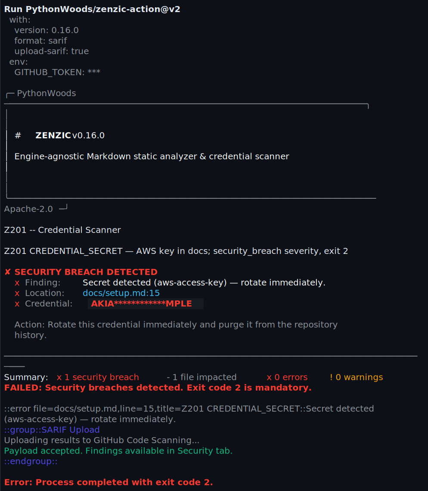

<!-- SPDX-FileCopyrightText: 2026 PythonWoods <dev@pythonwoods.dev> -->
<!-- SPDX-License-Identifier: Apache-2.0 -->

<p align="center">
  <picture>
    <source media="(prefers-color-scheme: dark)" srcset="assets/zenzic-wordmark-action-dark.svg">
    
  </picture>
</p>

<p align="center">The deterministic enforcement point for documentation integrity in CI. Exit codes are contractual — exits 2 and 3 survive <code>fail-on-error: false</code>.</p>

<p align="center">
  <a href="https://github.com/PythonWoods/zenzic-action/releases"></a>
  <a href="https://pypi.org/project/zenzic"></a>
  <a href="LICENSE"></a>
  <a href="https://zenzic.dev/developers/explanation/adr-vault"></a>
  <a href="https://reuse.software/"></a>
</p>

---

Run Zenzic checks in CI and surface results directly in GitHub Code Scanning, Pull Request annotations, and the Security tab — without reading logs.

**Exit code contract.** The wrapper propagates Zenzic's exit codes without remapping. Exit 1 (quality) obeys `fail-on-error`. Exit 2 (credential) and exit 3 (path traversal) terminate the job regardless of `fail-on-error: false` or `--exit-zero` — security findings are never suppressed at the enforcement boundary.

<p align="center">
  
</p>

## Core Features

| Feature | Description |
|---|---|
| Zero-setup install | `uvx zenzic` — no Python toolchain required on the runner |
| SARIF output | Findings feed directly into GitHub Code Scanning |
| Exit Code Contract | Security incidents (exit 2/3) are never suppressed by `fail-on-error` |
| Sovereign Audit mode | `audit: "true"` bypasses all suppressions — surfaces the true documentation state |
| SARIF integrity check | Validates JSON before upload; emits `::warning` if truncated by SIGKILL |
| PR annotations | Inline findings on the diff, colour-coded by severity |
| Version pinning | Pin to an exact release for deterministic, reproducible CI gates |
| **Clean prose** (v0.8.0) | `[governance.directory_policies]` in `zenzic.toml` grants zero-debt exemptions to path patterns — historical blog posts stay clean without consuming suppression cap |

## Quick Start

The minimal configuration — zero Python setup, SARIF to Code Scanning in one step:

```yaml title=".github/workflows/docs.yml"
- uses: actions/checkout@v6

- name: Run Zenzic Documentation Quality Gate
  uses: PythonWoods/zenzic-action@v1
  with:
    version: "0.7.1"
    format: sarif
    upload-sarif: "true"
  permissions:
    contents: read
    security-events: write
```

Place a `zenzic.toml` at the root of your repository and the action picks it up automatically — no `config-file` input required.

```yaml
jobs:
  docs:
    name: Documentation Quality
    runs-on: ubuntu-latest
    permissions:
      contents: read
      security-events: write
    steps:
      - uses: actions/checkout@v6

      - name: Run Zenzic
        uses: PythonWoods/zenzic-action@v1
        with:
          version: "0.7.1"       # pin to a stable release
          format: sarif           # emit SARIF for Code Scanning
          upload-sarif: "true"    # post results to the Security tab
          strict: "false"
          fail-on-error: "true"
```

> **Zero-Config Setup:** The action auto-discovers your Zenzic configuration automatically — no `config-file` input required. It searches in priority order: `zenzic.toml` in the repository root first, then `.github/zenzic.toml` as a fallback. This gives you identical behaviour between `zenzic check all` locally and in CI. To pin a specific file, set `config-file: path/to/zenzic.toml`.
> Run `zenzic init` once to scaffold a config if your docs live outside the default `docs/` folder.

> **Stability:** `version: "0.7.1"` is the default published pin today. For the latest features as they ship, you can set `version: latest`, but production pipelines should always pin to a specific release for deterministic, reproducible runs. **TODO(post-pypi-0.8.0):** bump all pinned examples/defaults to `0.8.0` immediately after publication.

## Configuration Discovery

The action is **zero-config by default**. On every run it performs a Root-First search for your Zenzic configuration:

| Priority | Location | When used |
|:---:|---|---|
| 1 | Explicit `config-file` input | Always honoured first if provided |
| 2 | `zenzic.toml` in repository root | Auto-discovered when no explicit override |
| 3 | `.github/zenzic.toml` | Fallback when root file is absent |
| — | *(none found)* | Zenzic uses its built-in defaults |

**Sovereign Intent Contract.** If you supply `config-file: path/to/custom.toml` but the file does not exist, the action **does not fall back** to auto-discovery. You receive a `::warning` annotation (or a fatal `::error` with `strict: true`). Silent fallthrough would be operational deception.

## Sovereign Override — Temporary URL Exclusions

Some documentation links point to pages that are temporarily unavailable in CI (staged deployments, blog posts published simultaneously with the release). The `ZENZIC_EXTRA_ARGS` environment variable lets you pass additional flags directly to the Zenzic CLI without modifying the action inputs:

```yaml
- name: Run Zenzic
  uses: PythonWoods/zenzic-action@v1
  with:
    version: "0.7.1"
    format: sarif
    upload-sarif: "true"
  env:
    ZENZIC_EXTRA_ARGS: >-
      --exclude-url https://example.com/blog/new-post
      --exclude-url https://staging.example.com
```

Each `--exclude-url` value becomes a separate argument. URL patterns that contain `*` or `?` are safe — the wrapper disables glob expansion before building the argument array, so no filesystem expansion occurs.

> **Scope:** `ZENZIC_EXTRA_ARGS` is for transient exclusions only. Permanent rules (e.g. always-exclude a documentation section, configure severity levels) belong in `zenzic.toml` so that local runs and CI share the same policy.

## Inputs

| Input | Default | Description |
|---|---|---|
| `version` | `0.7.1` | Zenzic version to install. Pin to a specific release for reproducible CI. Set `latest` for continuous evaluation. |
| `format` | `sarif` | Output format: `text`, `json`, or `sarif`. |
| `sarif-file` | `zenzic-results.sarif` | SARIF output path (when `format: sarif`). Must be a **relative** path inside the workspace. |
| `upload-sarif` | `true` | Upload SARIF to GitHub Code Scanning. |
| `strict` | `false` | Treat warnings as errors. |
| `fail-on-error` | `true` | Fail the workflow step on findings. |
| `config-file` | *(auto)* | Optional path to a config file. Auto-discovers `zenzic.toml` → `.github/zenzic.toml` when omitted. |
| `audit` | `false` | Sovereign audit mode: bypass all `zenzic:ignore` comments and `per_file_ignores`. Reveals the true unfiltered documentation state. Recommended for nightly builds and security review workflows. |
| `diff-base` | *(snapshot)* | Path to a JSON baseline file for `zenzic diff`. Use an artifact from the `main` branch to block PRs that increase technical debt. Falls back to `.zenzic-score.json` when omitted. |

## Outputs

| Output | Description |
|---|---|
| `sarif-file` | Path to the generated SARIF file. |
| `findings-count` | Total number of findings. |
| `score` | Documentation Quality Score (0–100). Available when `format: json` or when `diff-base` is set. |
| `suppression-debt-pts` | Technical Debt points deducted from the score due to active suppressions. `0` when no suppressions are active. |

## Exit Codes

| Code | Meaning | Suppressible? |
|:---:|---|:---:|
| `0` | All checks passed | — |
| `1` | Documentation findings | Yes (`fail-on-error: "false"`) |
| **`2`** | **Credential detected (Z201)** | **Never** |
| **`3`** | **Path traversal detected (Z202/Z203)** | **Never** |

---

## Advanced Governance: Scoring & Debt {#governance}

### The Zenzic Quality Gate — Block PRs on Regression

This is the recommended setup for teams that want to enforce documentation quality as a hard PR gate. The flow:

1. On `main`: Zenzic scans, scores, and saves the baseline snapshot as a CI artifact.
2. On every PR: Zenzic scans the PR branch, compares against the `main` baseline, and blocks the merge if the score dropped or if suppression debt exceeded the cap.

```yaml title=".github/workflows/zenzic-quality-gate.yml"
name: Zenzic Quality Gate

on:
  push:
    branches: [main]
  pull_request:

jobs:
  # Step 1 — Run on main and save the baseline artifact
  baseline:
    if: github.ref == 'refs/heads/main'
    runs-on: ubuntu-latest
    permissions:
      contents: read
      security-events: write
    steps:
      - uses: actions/checkout@v6

      - name: Run Zenzic and save baseline
        uses: PythonWoods/zenzic-action@v1
        with:
          version: "0.7.1"
          format: json        # json format triggers score snapshot save
          upload-sarif: "false"

      - name: Upload baseline artifact
        uses: actions/upload-artifact@v4
        with:
          name: zenzic-baseline
          path: .zenzic-score.json
          retention-days: 90

  # Step 2 — Run on PRs, compare against main baseline
  quality-gate:
    if: github.event_name == 'pull_request'
    runs-on: ubuntu-latest
    permissions:
      contents: read
      security-events: write
    steps:
      - uses: actions/checkout@v6

      - name: Download main baseline
        uses: actions/download-artifact@v4
        with:
          name: zenzic-baseline
          path: .zenzic-baseline/
        continue-on-error: true  # first PR has no baseline yet

      - name: Run Zenzic — Quality Gate
        uses: PythonWoods/zenzic-action@v1
        with:
          version: "0.7.1"
          format: sarif
          upload-sarif: "true"
          diff-base: ".zenzic-baseline/.zenzic-score.json"  # compare vs main
        id: zenzic

      - name: Report score
        if: always()
        run: |
          echo "Score: ${{ steps.zenzic.outputs.score }}"
          echo "Suppression debt: ${{ steps.zenzic.outputs.suppression-debt-pts }} pts"
          echo "Findings: ${{ steps.zenzic.outputs.findings-count }}"
```

> **What happens on regression?** The action emits a `::error` annotation: `"Documentation quality score dropped vs baseline. The Zenzic Quality Gate blocked this PR."` The PR check fails. No score-reducing merge enters `main`.

---

### Sovereign Audit — Nightly Build Without Suppressions

Run a weekly audit that bypasses all active `zenzic:ignore` suppressions to surface the true documentation state:

```yaml title=".github/workflows/zenzic-audit.yml"
name: Zenzic Sovereign Audit

on:
  schedule:
    - cron: "0 3 * * 1"  # every Monday at 03:00 UTC
  workflow_dispatch:

jobs:
  audit:
    runs-on: ubuntu-latest
    permissions:
      contents: read
      security-events: write
    steps:
      - uses: actions/checkout@v6

      - name: Run sovereign audit (suppressions bypassed)
        uses: PythonWoods/zenzic-action@v1
        with:
          version: "0.7.1"
          format: sarif
          upload-sarif: "true"
          audit: "true"          # bypass all zenzic:ignore and per_file_ignores
          fail-on-error: "false" # audit is observational, not blocking
```

The audit result appears in the **Security → Code Scanning** tab. Every suppressed finding is visible. Review them weekly to ensure suppressed debt remains intentional.

---

When `format: sarif` and `upload-sarif: true`, Zenzic findings appear:

- In the **Security → Code Scanning** tab of the repository.
- As **inline annotations** on Pull Request diffs.
- Colour-coded by severity: errors in red, warnings in yellow, security findings with a CVSS-style score (`9.5` for credential breaches, `9.0` for path-traversal incidents).

No additional configuration needed — the action handles the upload via `github/codeql-action/upload-sarif`.

## How it works

1. Installs `uv` with cache enabled.
2. Runs `uvx "zenzic==<version>"` (or `uvx zenzic` for latest) — a single isolated invocation, no pre-install step.
3. Writes the SARIF report to `sarif-file` (stdout only; stderr streams to the step log).
4. Validates SARIF JSON integrity — emits a `::warning` annotation if the file is truncated (e.g. due to SIGKILL).
5. Uploads via `github/codeql-action/upload-sarif`.

## Supported Environments

| Component | Minimum | Recommended | Notes |
|:--|:--|:--|:--|
| **GitHub-hosted runner** | `ubuntu-22.04` | `ubuntu-latest` | macOS and Windows runners are also supported |
| **Self-hosted runner** | Any OS with `bash` ≥ 5 and `python3` ≥ 3.11 | — | `uv` is installed by the action; no pre-install needed |
| **Node.js** | 24 | 24 | Required by `github/codeql-action/upload-sarif@v4` |
| **`astral-sh/setup-uv`** | v8 | v8 | Earlier versions lack full cross-platform cache support |
| **`github/codeql-action`** | v4 | v4 | v3 deprecated; v2 reached end-of-life March 2024 |
| **`actions/checkout`** | v6 | v6 | Must run before this action |

> **Self-hosted runners:** ensure `python3` (3.11+) and `bash` (5+) are available in `PATH`.
> `uv` is installed by the action via `astral-sh/setup-uv` — no pre-installed Python toolchain required.

## Ecosystem

| Component | Repository / URL | Description |
|---|---|---|
| **Zenzic CLI** | [PythonWoods/zenzic](https://github.com/PythonWoods/zenzic) | Core linter — install with `pip install zenzic` or run via `uvx zenzic` |
| **Documentation** | [zenzic.dev](https://zenzic.dev) | Configuration reference, rule catalogue, and how-to guides |
| **Brand System** | [zenzic.dev/assets/brand/zenzic-brand-system.html](https://zenzic.dev/assets/brand/zenzic-brand-system.html) | Visual identity, badges, and SVG assets |
| **zenzic-action** | [PythonWoods/zenzic-action](https://github.com/PythonWoods/zenzic-action) | This repository |

---

## 📖 Documentation Map — The Integrity Promise

The Zenzic documentation lives across **two separate Docusaurus instances** under
[zenzic.dev](https://zenzic.dev) — the user area and the developer area never
share a sidebar or a search index.

```text
zenzic.dev/
├── docs/           → User Area    — install, configure, CI/CD, finding codes
├── developers/     → Dev Area     — rule extensions, adapters, ADRs, tech debt ledger
├── blog/           → Release notes & engineering post-mortems
└── community/      → Brand kit, FAQs, governance
```

The split is enforced by [ADR 011: Cross-Instance Allowlist](https://zenzic.dev/developers/explanation/adr-cross-instance-allowlist) — every cross-boundary link is a documented contract, never a silent suppression.

| You are a... | Start here |
| :--- | :--- |
| 👤 Action user (CI integrator) | [CI/CD Guide](https://zenzic.dev/docs/how-to/configure-ci-cd/) |
| 🔧 Action contributor | [Developer Portal](https://zenzic.dev/developers/) · [ADR Vault](https://zenzic.dev/developers/explanation/adr-vault) |
| 🛡️ Security reviewer | [Engineering Ledger](https://zenzic.dev/developers/explanation/engineering-ledger) · [SECURITY.md](SECURITY.md) |

---

## Deep Dive — Security Architecture

For a complete description of how the wrapper enforces security, handles exit codes, and performs configuration discovery, see the official documentation:

> **[GitHub Action Internals — zenzic.dev](https://zenzic.dev/docs/explanation/github-action-internals)**
>
> Covers: Path Traversal Guard Protocol · Exit Code Contract · Root-First Zenzic cascade · Sovereign Intent Contract · SARIF integrity guard.

---

## License

Apache-2.0 — see [LICENSE](LICENSE).
